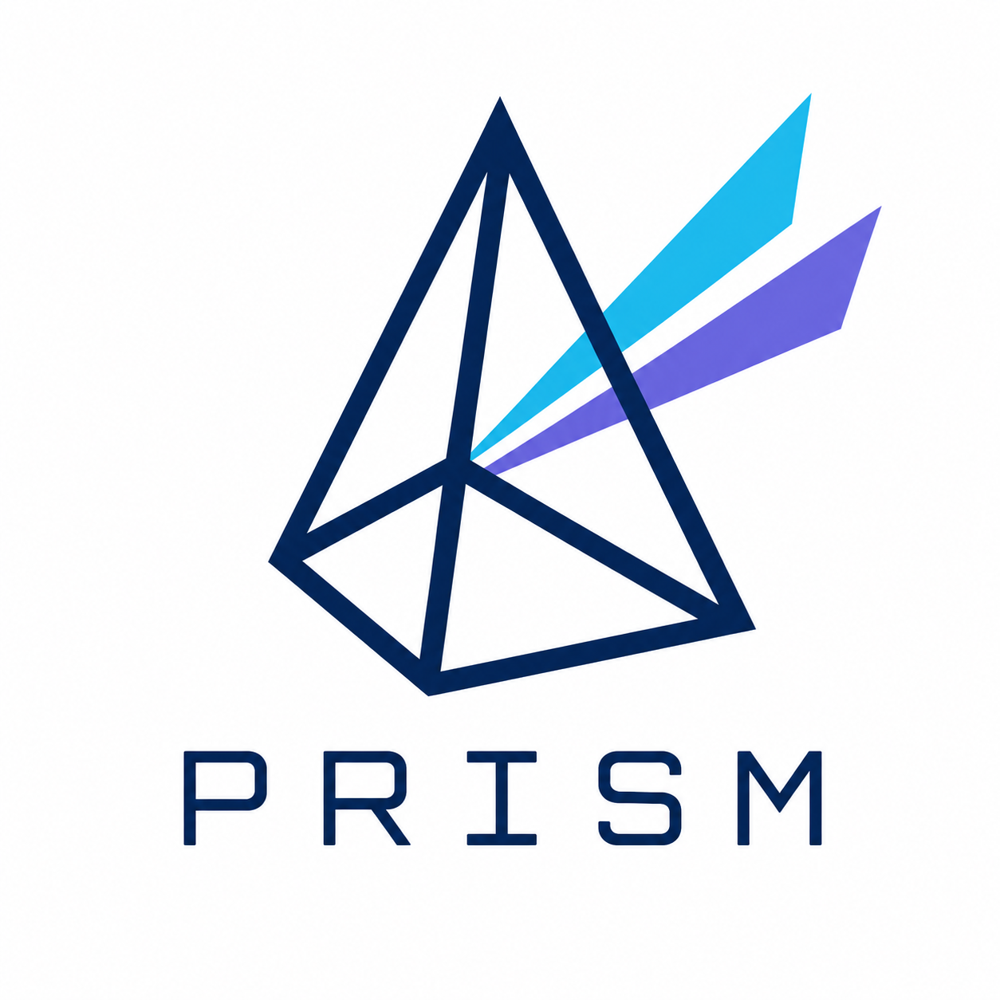

# Prism

<p align="center">
  
</p>

An agentic equity research system — a set of independent commands, each usable on its own.

---

## Setup

Prism runs inside Claude Code. One-time setup:

1. **Copy the env template** and fill in whichever keys you want (all are optional except `OPENAI_API_KEY` for `/podcast` — see the table):
   ```
   cp .env.example .env
   ```
2. **Run the setup script** — installs Python deps (`yfinance`), checks for `ffmpeg` / `gh`, and verifies every environment variable and settings file below (it loads `.env`, so it sees values configured there). Safe to re-run.
   ```
   bash setup.sh
   ```

**Environment variables** — set in `.env` (gitignored), or in your cloud sandbox's env:

| Variable | Used by | Required? |
|---|---|---|
| `OPENAI_API_KEY` | `/podcast` (TTS) | **Required** for `/podcast` |
| `NOTION_TOKEN` | `/log-trade` (write), `/scout` (read) | Optional — without it, `/log-trade` logs locally only and `/scout` skips the Notion read |
| `NOTION_INVESTMENT_LOG_DATA_SOURCE_ID` | `/log-trade` | Optional — falls back to resolving the "Investment Log" DB by name |
| `NOTION_INVESTMENT_LOG_DATABASE_ID` | `/scout`, `/log-trade` | Optional — same name fallback |
| `EDGAR_CONTACT_EMAIL` | `/scout`, `/research` (SEC EDGAR requires a contact email in the request header) | Recommended — falls back to a generic placeholder |
| `X_BEARER_TOKEN` | `/scout` (X signal source) | Optional — without it, scout runs on GDELT / HN / EDGAR |

**Settings files:**

- **`.claude/scout-x-feeds.json`** — the curated X accounts `/scout` pulls from (`handles[]`, optional `topics` / `note` per account). Ships as an example template; edit it with accounts you actually follow. Only used when `X_BEARER_TOKEN` is set; harmless to leave as the template otherwise.
- **Notion MCP** — `/log-trade` and `/scout` reach Notion through the MCP server wired in `.mcp.json` (`@notionhq/notion-mcp-server`, launched by `scripts/start-notion-mcp.sh`, which reads `NOTION_TOKEN` from `.env`). Create a Notion *internal integration*, copy its secret into `NOTION_TOKEN`, and share your Investment Log database with that integration. Step-by-step in `.env.example`.

**System tools:** `ffmpeg` (podcast audio stitching), `gh` (PR creation), `python3`. `setup.sh` checks for these.

---

## Two-repo workflow (optional)

Prism's outputs are personal — trades, reports, journal entries. The recommended way to run it long-term is **two sibling repos**:

- **The engine** (this repo, public): `scripts/`, `.claude/agents/`, `.claude/commands/`, `CLAUDE.md`, `README.md`, `setup.sh`. Tracking files ship as empty templates.
- **Your daily driver** (a private repo): the same engine files plus your real data (`reports/`, `scouts/`, `tracking/*.json`, generated dashboard, real X follows, `.env`).

Engine changes belong in the engine repo first, then flow to the private repo; changes made in the private repo during daily use get ported back — with anything personal stripped. `/sync` (`.claude/commands/sync.md`) automates both directions: it diffs the engine file set between the sibling checkouts, infers direction per file from git history, sanitizes anything flowing into the public repo, and lands the changes as a PR in the receiving repo. Engine files stay byte-identical across the pair; only the personal data ever differs.

Single-repo use works fine too — just clone and go. The split only matters once you have data you don't want public.

---

## Scout

```
/scout <focus>
```

Mines free signal sources for emerging themes within a direction you give it. Returns a ranked brief with suggested research questions — no research is run.

**How it works:**

1. Expands your focus into a per-source query spec (`queries.json`) — picks terms specific enough to spike (e.g. "AI inference cost" not "AI").
2. Fetches raw signals from GDELT (coverage-volume spikes), Hacker News (velocity), and SEC EDGAR (filings) — and, if configured, recent posts from a curated X follow list (engagement velocity). No LLM.
3. Clusters signals into candidate themes, checks against past reports (a fresh signal on a covered topic surfaces as a follow-on, not a duplicate), scores by relevance / novelty / researchability.
4. Writes a ranked brief.

**X source (optional):**

- **`.claude/scout-x-feeds.json`** — the accounts you follow for high-value signal (`handles[]`, optional `topics`/`note` per account). A substantive post from one of them is weighted like a fresh filing.
- **`X_BEARER_TOKEN`** — X API v2 app-only bearer token, a tier with user-timeline read (shell env or `.env`). Without the token or the file, scout runs on the free sources exactly as before.

**Output** → `scouts/YYYY-MM-DD-HHMMSS/`

- **`queries.json`** — the per-source query spec built from your focus.
- **`signals.json`** — raw normalized signals.
- **`brief.md`** — ranked candidate themes, each with a why-now rationale, a suggested research question, effort estimate, and an investable call.

Each run is committed on its own branch and opened as a Pull Request (remote `origin`, base `main`).

---

## Research

```
/research <question> [sources:<url,...>] [effort:quick|low|medium|high]
```

Refracts the question into sub-questions, researches them in parallel, iterates against a director's critique, and synthesizes a final report.

**How it works:**

1. Director decomposes the question into a two-layer question tree (`plan.md`).
2. Layer-2 items are grouped into 3–8 bundles; one researcher per bundle runs in parallel.
3. Director critiques all reports and re-dispatches for revision. Rounds: `quick`=0 (no critique pass), `low`=1, `medium`=2, `high`=4 (upper bounds — director may stop earlier).
4. If the question implies investable output, a second pass runs per-ticker deep dives with explicit **Thesis verdict** (does the hypothesis hold?) and **Market verdict** (Buy / Hold / Avoid for a multi-year holder). Two verdicts per ticker is deliberate — being right about the trend and being right about the trade are different problems.
5. Director synthesizes a final report as a graph: connections, contradictions, cascades.

`effort:quick` is the fast high-level mode: 2–3 bundles at survey depth, no `critiques/` artifacts, and one combined ticker scan (`tickers/ticker-scan.md`) instead of per-ticker deep dives — you still get meta-trends, theses, and the verdict table, in a fraction of the time.

**Output** → `reports/YYYY-MM-DD-<slug>/`

- **`final-report.md`** — the synthesis (meta-trend → investment thesis → per-ticker verdicts).
- **`individual/`**, **`tickers/`**, **`critiques/`**, **`plan.md`** — supporting artifacts.

Each run is committed on its own branch and opened as a Pull Request.

---

## Podcast

```
/podcast <run-dir>
```

Turns a finished research report into a 3-voice podcast episode via OpenAI TTS. The research PR must be merged into `main` before running.

**How it works:**

1. Syncs `main` and verifies `final-report.md` is present. If not: "report not on main — merge its research PR first."
2. Reads the report and writes a Moderator / Lead / Skeptic dialogue script. No new research — every claim traces back to the report.
3. Synthesizes audio per line via OpenAI TTS, then stitches into `episode.mp3` via ffmpeg. ~$0.30/episode.

**Requirements:** `OPENAI_API_KEY` (shell env or `.env`), `ffmpeg`, `python3`.

**Output** → `reports/YYYY-MM-DD-<slug>/podcast/`

- **`episode.mp3`** — stitched 3-voice episode.
- **`script.md`**, **`outline.md`**, **`episode.json`** — supporting artifacts.

Each run is committed on its own branch and opened as a Pull Request.

---

## Dashboard

```
python scripts/generate_dashboard.py
open dashboard/index.html
```

Generates a local HTML dashboard from the tracking files. No server required — opens directly in the browser.

**Three views:**

- **Timeline** — chronological interleaving of research runs, trades, and journal reflections, showing which research preceded which trade and what you were thinking along the way.
- **Research → Trade Alignment** — every trade row linked to the research that drove it (from `trades.json`), with alignment classification (aligned / misaligned / unlinked) and lag in days between research and trade.
- **Per-Ticker Drilldown** — full research history for a ticker (all runs that covered it, with thesis evolution and verdicts), trade history with shares and price, unrealized P&L vs. current price, and active falsifiers / event monitors.

**Requirements:** `yfinance` (for current prices and P&L). Install via `pip install yfinance` or run `bash setup.sh`.

---

## Investment Log

```
/log-trade <description>
```

Logs an investment action to the Notion Investment Log database, links it to the research that drove it, and updates the local tracking layer.

**How it works:**

1. Parses your natural-language description into trade fields — ticker, amount, action (`buy`/`add`/`trim`/`sell`), and optional shares, price, and comment.
2. Finds research runs that covered the ticker and asks which informed the trade, then inserts the row into the Notion Investment Log database with the research linked as a hyperlink in the Comment.
3. Updates the tracking layer: `trades.json` always; `portfolio.json` / `candidates.json` when a position is opened (candidate → portfolio) or fully exited. Regenerates the dashboard.
4. Lands on its own branch + Pull Request, same as every other command.

**Requirements:** a Notion integration token in `NOTION_TOKEN` (the MCP server wired in `.mcp.json` reads it from `.env`), with your Investment Log database shared to that integration. Optionally pin the database via `NOTION_INVESTMENT_LOG_DATA_SOURCE_ID` / `NOTION_INVESTMENT_LOG_DATABASE_ID` (otherwise it's resolved by name). Without Notion configured, `/log-trade` still records every trade locally in `trades.json`. See the **Setup** section and `.env.example`.

**Examples:**

```
/log-trade NVDA $2700 added on dip
/log-trade BRKB $1900 — trimmed, valuation stretched
/log-trade May 30 CRM $500
```

---

## Journal

```
/journal <reflection>
```

Captures a free-form reflection — a hesitation, an imagined scenario, a road not taken — into the dashboard timeline, so you can look back and reflect on your thinking, not just your trades. No research, no Notion.

**How it works:**

1. Takes your reflection text verbatim.
2. Always asks which research runs and tickers to link, suggesting matches from the text (recent runs, and tickers tagged `[PORTFOLIO]` / `[CANDIDATE]` / `[NEW]`). A linked `[NEW]` ticker can be added to `candidates.json` on the spot.
3. Appends the entry to `journal.json`, regenerates the dashboard (the entry shows as a violet node in the Timeline), and lands on its own branch + Pull Request.

**Output** → `tracking/journal.json` (and a timeline node in the dashboard)

**Examples:**

```
/journal hesitated on adding to NVDA before earnings — felt fully priced
/journal what if I'd kept the full SNAP position instead of rotating into RKLB? revisit in 6mo
```

---

The five commands are independent — none assumes another ran first. You can chain them (scout a theme, research a candidate it surfaced, podcast the result, log the trade, journal the second-guessing), but nothing forces that order. Each run lands on its own branch and Pull Request off up-to-date `main`; you're prompted before anything is committed, pushed, or merged.

---

## Tracking

Research runs accumulate a persistent tracking layer across five JSON files in `tracking/`:

- **`portfolio.json`** — tickers you hold: each position carries a `reports[]` array (how the thesis evolved across runs) and an `events[]` array (buy triggers, falsifiers, event monitors to watch)
- **`candidates.json`** — tickers under consideration: user-curated, same schema. You add tickers manually; research runs populate their `reports[]` and `events[]` for active entries.
- **`catalysts.json`** — system-level events with expected dates: regulatory decisions, IPOs, macro policy changes
- **`trades.json`** — log of every individual trade execution: date, ticker, action, amount, shares, price per share, and a `linked_research[]` array pointing to the specific research runs that motivated the trade. Written by `/log-trade`; read by the dashboard for alignment analysis and P&L.
- **`journal.json`** — free-form reflections from `/journal`: text plus optional `linked_research[]` and `linked_tickers[]`. A capture log for your thinking — hesitations, imagined scenarios, roads not taken — read by the dashboard for the timeline.

**How it feeds:**

- Every `/research` run appends to these files (Phase 8 of the director). For tickers in `portfolio.json` or `candidates.json`: the run adds a `reports[]` entry (thesis, entry condition, verdict) and updates `events[]` (buy triggers, falsifiers, event monitors). New tickers (`[NEW]`) are not auto-written — at the end of the run the director lists them and asks which to add to `candidates.json`.
- Each event entry carries a `history` array — verdict changes, rechecks, and resolutions are logged with timestamps and source files.

**How it closes the loop:**

- Every `/scout` run reads all three files. Signals about held tickers surface as **Portfolio signals**; signals matching active event entries surface as **Watchlist alerts**; everything else is **New candidates** — all in separate brief sections.
- The final report tags each ticker block as `[PORTFOLIO]`, `[CANDIDATE]`, or `[NEW]` so the framing is always relative to your actual holdings.
- When a catalyst fires, a `/research` run on the event resolves the catalyst entry and propagates history events to all affected ticker entries.

See `tracking/README.md` for the full schema, ID generation rule, resolution protocol, and manual lifecycle instructions.
